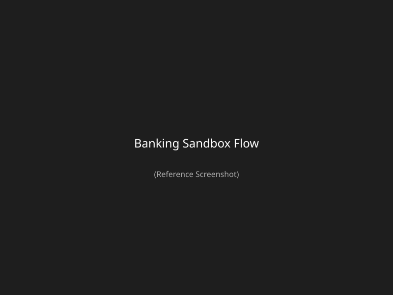

# 🏦 Banking Sandbox Tutorial

Welcome to the Dynamic Mock Reference Banking Sandbox! In under 5 minutes, you will simulate a complete, stateful ISO8583 payment flow.

## What You Will Learn
- How to load a pre-configured sandbox.
- How to send ISO8583 messages using the Simulator.
- How stateful scenarios track transaction lifecycles.

---

### Step 1: Load the Sandbox
1. If your workspace is completely empty, you will see a large button in the center of the screen: **Load Reference Banking Sandbox (5-Minute Quickstart)**.
2. Click the button.
3. The page will reload, and your workspace will now contain a pre-configured `Banking Sandbox ISO8583` endpoint and a `Card Payment Flow` scenario.

---

### Step 2: Open the Simulator
1. In the left sidebar, under **ISO8583 Endpoints**, click on `Banking Sandbox ISO8583`.
2. Ensure the endpoint is **Active**. The server is now running on port `8583`.
3. In the main panel, click the **Simulator** tab.

---

### Step 3: Send an Authorization (0100)
1. In the Simulator, select **0100** from the MTI dropdown.
2. Fill in the required fields (or use the defaults).
3. Click **Send Request**.
4. **Observe the Response**: You should instantly receive a `0110` response with Field 39 highlighted green as `00` (Approved).

---

### Step 4: Observe the State Transition
1. In the left sidebar, under **Scenarios**, click on `Card Payment Flow`.
2. Look at the **State Inspector** panel.
3. You will see the state has moved from `INITIAL` to **`AUTHORIZED`**.
4. The execution count is `1`, and if you provided an amount in Field 4, you will see `lastAuthAmount` stored in the variable table.

---

### Step 5: Send a Reversal (0420)
1. Go back to the **Simulator** tab on your ISO8583 endpoint.
2. Change the MTI to **0420** (Reversal).
3. Click **Send Request**.
4. You will receive a `0430` response (Approved).
5. Flip back to the **Scenario Inspector**. The state has now transitioned to **`REVERSED`**.

---

### 🎉 Congratulations!
You have successfully simulated an enterprise-grade financial transaction lifecycle without writing a single line of code!

